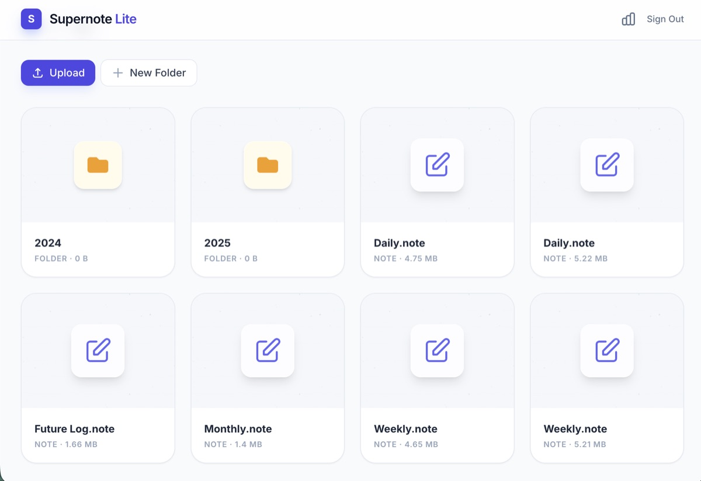
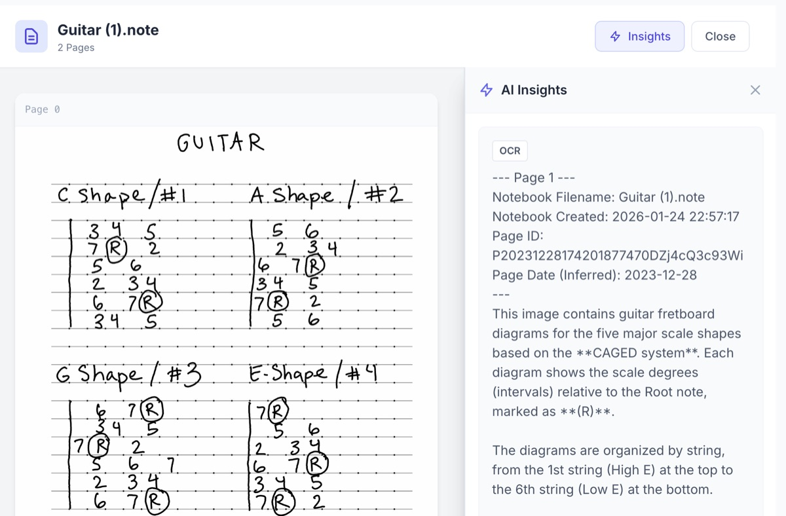
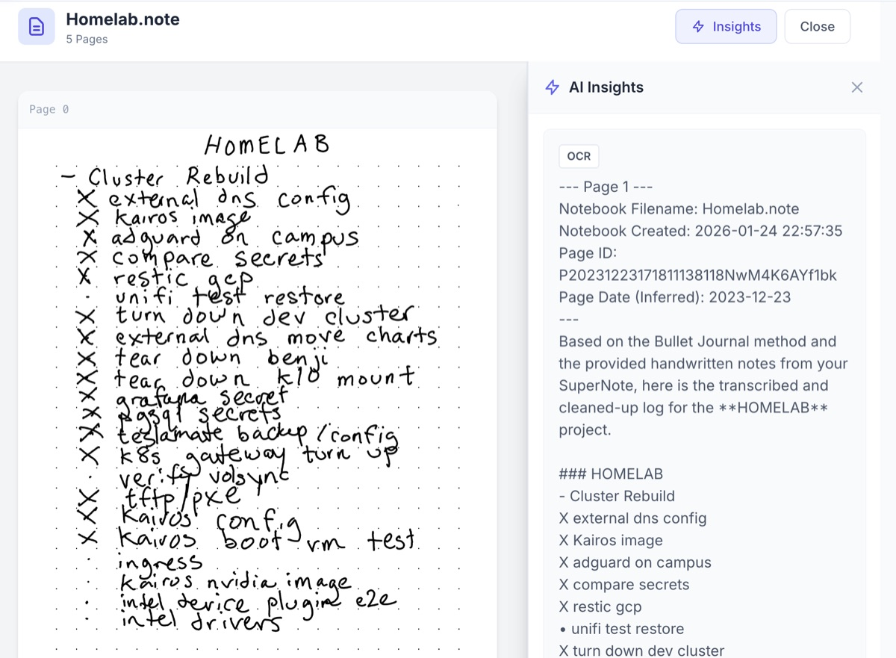
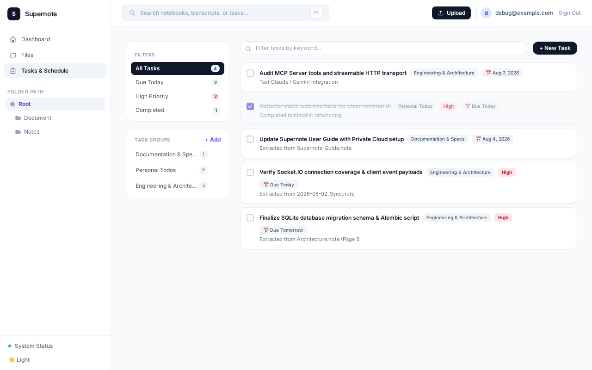
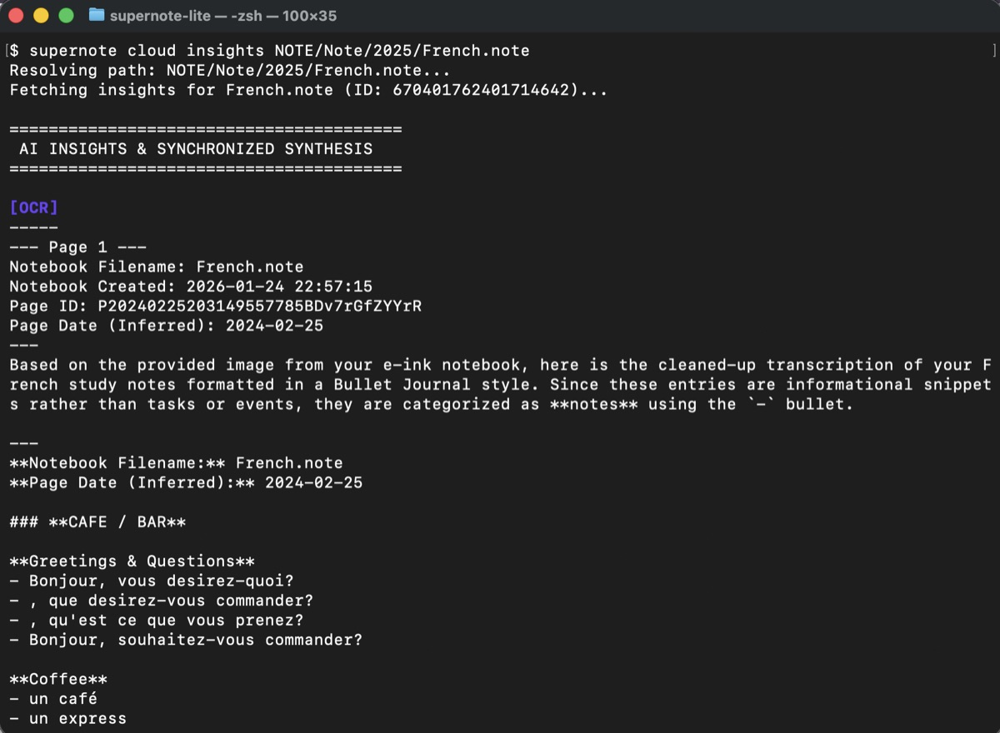
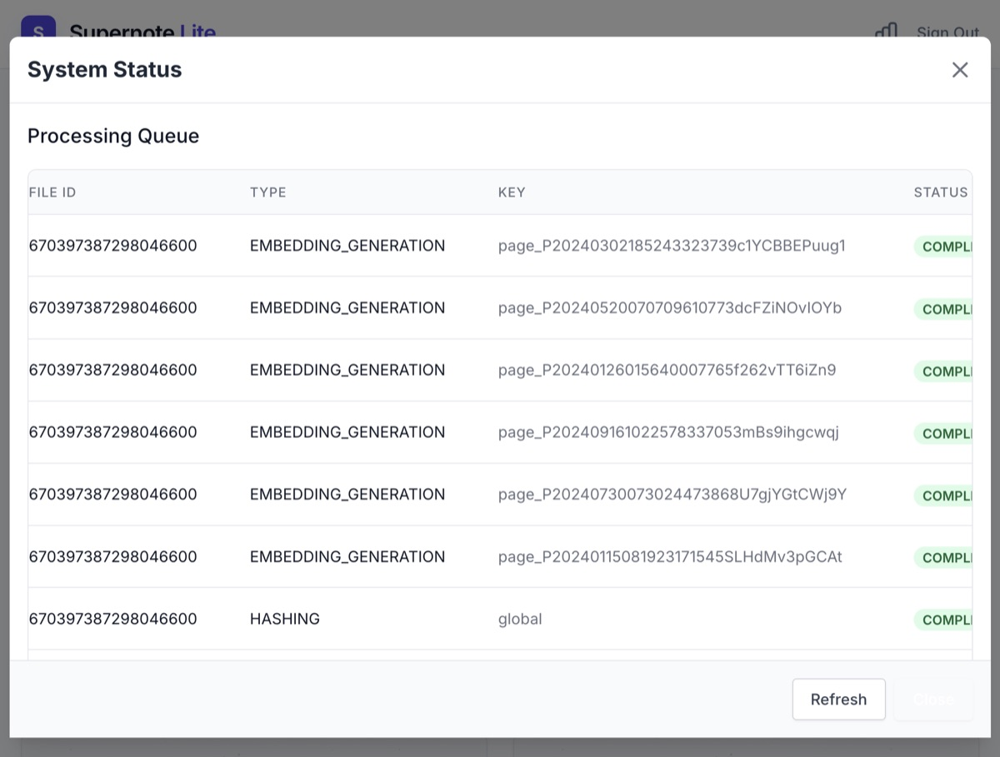
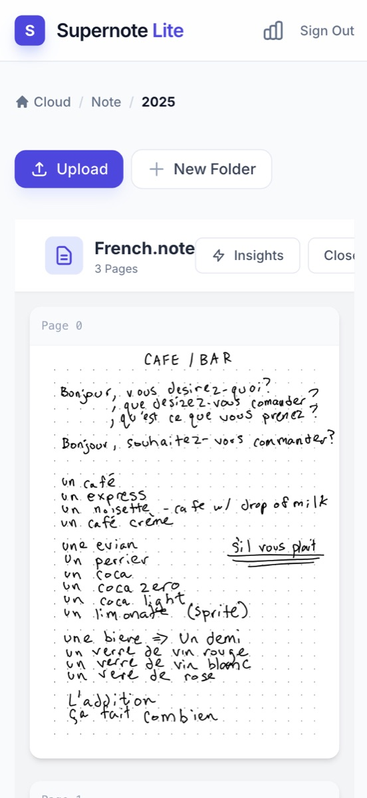

# Supernote Private Cloud with Apple OCR

**A lightweight, self-hosted private cloud server and optional AI intelligence layer for your Ratta Supernote — with handwriting transcription and semantic search running entirely on your own hardware, no cloud AI key required.**

This is a fork of [allenporter/supernote](https://github.com/allenporter/supernote), a self-hosted, SQLite-based implementation of the **Supernote Private Cloud** protocol. It provides a simple and resource-efficient sync server with a minimal resource footprint (typically ~200MB idle memory, and 300–400MB to process large notebooks). It implements **100% of the community [Supernote OpenAPI Specification](api-spec/openapi.yaml)**, and can optionally be enhanced with an **AI-driven synthesis engine**—transforming your handwritten notes into structured, searchable knowledge.

This fork replaces the upstream project's Gemini-based OCR and embedding pipeline with a fully local stack:

- **[Apple Vision](https://developer.apple.com/documentation/vision) OCR** (via [`visionocr-service`](visionocr-service/), a small HTTP wrapper run on a Mac) transcribes handwriting instead of Gemini Vision.
- **[Ollama](https://ollama.com/)** (`bge-m3`) generates embeddings for semantic search instead of Gemini's embedding API.
- Gemini remains available, opt-in, for AI-generated summaries only (`SUPERNOTE_GEMINI_API_KEY`) — see [Customizing AI Prompts](#customizing-ai-prompts) below.

<p align="center">
  
</p>

[](https://allenporter.github.io/supernote/)
[](LICENSE)

## Why Supernote Private Cloud with Apple OCR?

This project is designed to be **fully compatible** with the official Supernote Private Cloud protocol, serving as a lightweight alternative that operates on a single SQLite database and runs comfortably on low-power NAS setups and home lab servers:

- **⚡ Lightweight Sync**: Runs on a simple, efficient Python/Asyncio stack with SQLite. Consumes ~200MB of idle memory (recommending 300–400MB for notebook processing).
- **📋 OpenAPI Spec Compliant**: Implements **100% of the community [Supernote OpenAPI specification](api-spec/openapi.yaml)**.
- **🛡️ Private & Secure**: You own your database and files. Runs locally on your NAS or local server with no external data leakage — OCR and embeddings run on your own hardware, not a third-party API.
- **🖥️ Sleek Web UI**: Browse notes, manage tasks, and export iCalendar (`.ics`) task feeds for Home Assistant, Apple Calendar, Google Calendar, and Outlook.
- **✍️ Local OCR**: Handwriting transcription runs on-device via Apple's Vision framework ([`visionocr-service`](visionocr-service/)) — no API key, no per-page cost, no images leaving your network.
- **🔍 Local Semantic Search**: Vectorizes content via a self-hosted Ollama instance for concept-based search across all notebooks.
- **📜 Optional AI Summaries**: If configured with a Gemini API key, it can additionally generate summaries (Daily, Weekly, Monthly).
- **🤖 Agent Ready (MCP)**: Securely connect your notes to AI agents (Claude, Gemini, ChatGPT) via the built-in [Model Context Protocol](https://modelcontextprotocol.io/) server.

## Synthesis & AI in Action

Beyond simple storage, Supernote provides an active processing pipeline to increase the utility of your notes:

1.  **Sync**: Your device uploads `.note` files using the official Private Cloud protocol.
2.  **Transcribe**: The server extracts pages and uses local Apple Vision OCR to transcribe your handwriting.
3.  **Synthesize**: AI Analyzers review your journals to find tasks, themes, and summaries.
4.  **Index**: Every word is embedded via a local Ollama model, enabling semantic search across your entire library.

### Web Interface

The integrated frontend allows you to review your notes, manage task lists, and view AI insights side-by-side.

<p align="center">
  
  
</p>

<p align="center">
  
</p>

## Quick Start

You can run the server either as a **Lite Sync Server (Zero-Config)** or with the **AI & Semantic Search features enabled**.

### 1. Launch the Server

Choose one of the options below to start the server.

#### Option A: Lite Sync Server (Zero-Config)
No API keys or external services required. Runs locally with SQLite.

*   **Using Python**:
    ```bash
    pip install "supernote[server]"
    supernote serve
    ```
*   **Using Docker**:
    ```bash
    # Build the docker image locally
    docker build -t supernote .

    # Run the container (maps the local storage/ folder to the container's /data volume)
    docker run -d \
      -p 8080:8080 \
      -v $(pwd)/storage:/data \
      --name supernote-server \
      supernote
    ```

#### Option B: AI & Knowledge Hub (Local Apple Vision OCR + Ollama)
Enables handwriting transcription and semantic search, running entirely on your own
hardware — no cloud AI key required:

- **OCR**: point `SUPERNOTE_APPLE_VISION_OCR_URL` at a running
  [`visionocr-service`](visionocr-service/) instance (a small HTTP wrapper around Apple's
  Vision framework — install it on any Mac on your network).
- **Embeddings / semantic search**: point `SUPERNOTE_OLLAMA_BASE_URL` at a running
  [Ollama](https://ollama.com/) instance serving the `bge-m3` model (or set
  `SUPERNOTE_OLLAMA_EMBEDDING_MODEL` to another embedding model of your choice).

```bash
export SUPERNOTE_APPLE_VISION_OCR_URL="http://<mac-ip>:8090/ocr"
export SUPERNOTE_OLLAMA_BASE_URL="http://<ollama-host>:11434"
pip install "supernote[all]"
supernote serve
```

See [`deploy/README.md`](deploy/README.md) for a full Docker Compose stack
(`supernote-server` + `ollama`, plus `visionocr-service` running separately on a Mac),
including Tailscale-based network isolation. AI-generated summaries are a separate,
still-optional feature layered on top — set `SUPERNOTE_GEMINI_API_KEY` to enable those.

### 2. Bootstrap Your User

Once the server is running, register your administrator account:

*   **Using Python CLI**:
    ```bash
    # Create the initial admin account
    supernote admin --url http://localhost:8080 user add you@example.com

    # Authenticate your CLI
    supernote cloud login you@example.com --url http://localhost:8080
    ```
*   **Using Docker CLI**:
    ```bash
    # Create the initial admin account
    docker exec -it supernote-server supernote admin --url http://localhost:8080 user add you@example.com
    ```

### 3. Connect Your Device

1. On your Supernote, go to **Settings > Sync > Private Cloud**.
2. Enter your server URL (e.g., `http://192.168.1.5:8080`).
3. Log in with the email and password you created in Step 2.
4. Tap **Sync** to begin syncing your notes.

### 4. Explore Your Insights

Once your notes sync and process, you can view the AI synthesis from the terminal or browser:

```bash
# Get a high-level summary and transcription
supernote cloud insights /Notes/NOTE/Journal.note

# Semantic search across all notebooks
supernote cloud search "What were my project goals for February?"
```

<p align="center">
  
</p>

You can access the insights from the MCP server at `http://<your ip:port>/mcp`

> [!TIP]
> **Semantic Search**: Supernote doesn't just look for words—it understands concepts. Searching for "budget" will find notes about "expenses" or "money," even if the specific word isn't there.

## Features Deep Dive

- **Official Protocol Compatibility**: Implements the official **Supernote Private Cloud** protocol for seamless device synchronization. While Ratta's official service provides a robust and managed sync experience, this project allows for local data ownership and custom background processing.
- **Notebook Parsing**: Native, high-fidelity conversion of `.note` files to PDF, PNG, SVG, or plain text.
- **Developer API**: Modern `asyncio` client to build your own automation around Supernote data.
- **iCalendar Feed Export (.ics)**: Preview, copy, and download task feeds in RFC 5545 VTODO `.ics` format for Home Assistant, Apple Calendar, Google Calendar, and Outlook.
- **Observability**: Built-in request tracing and background task monitoring.

<p align="center">
  
  
</p>

## Installation

```bash
# Install specific components
pip install supernote              # Notebook parsing only
pip install supernote[server]      # + Private server & AI features
pip install supernote[client]      # + API Client

# Full installation (recommended for server users)
pip install supernote[all]
```

## Local Development Setup

To set up the project for development, please refer to the [Contributing Guide](docs/CONTRIBUTING.md).

### Parse a Notebook (Local)

```python
from supernote.notebook import parse_notebook

notebook = parse_notebook("mynote.note")
notebook.to_pdf("output.pdf")
```

The notebook parser is a fork and slightly lighter dependency version of [supernote-tool](https://github.com/jya-dev/supernote-tool). All credit goes to the original authors for providing an amazing low-level utility.

### Run with Docker

```bash
# Build the image locally
docker build -t supernote .

# Run container (maps your local storage directory to the container's /data volume)
docker run -d \
  -p 8080:8080 \
  -v $(pwd)/storage:/data \
  --name supernote-server \
  supernote
```

See [Server Documentation](https://github.com/allenporter/supernote/blob/main/supernote/server/README.md) for more configuration details.

### Developer API

Integrate Supernote into your own Python applications:

```python
from supernote.client import Supernote
# See library docstrings for usage examples
```


## CLI Usage

```bash
# Server & Admin
supernote serve                      # Start the cloud
supernote admin user list           # Manage your users

# AI Synthesis & Insights
supernote cloud insights /Note.note # View synthesis from CLI

# File Operations
supernote cloud ls /                # List remote files
supernote cloud download /Note.note # Download to local machine
```

## Notebook Operations (Local)

You can use the built-in parser outside of the cloud server:

```python
from supernote.notebook import parse_notebook

note = parse_notebook("journal.note")
note.to_pdf("journal.pdf")  # Multi-layer PDF conversion
```

The notebook parser is a fork of the excellent [supernote-tool](https://github.com/jya-dev/supernote-tool) with updated dependencies and modern type hints.

## Customizing AI Prompts

If you enable Gemini (for OCR or Summarization), you can customize the prompts it's given
by pointing the server to a custom prompts directory. Apple Vision OCR is a local, prompt-free
recognizer and isn't affected by these templates.

### 1. Configuration
Set the custom prompts directory using either:
*   **Environment Variable**:
    ```bash
    export SUPERNOTE_PROMPTS_DIR="path/to/your/prompts"
    ```
*   **Config File (`config.yaml`)**:
    ```yaml
    prompts_dir: "path/to/your/prompts"
    ```

### 2. Directory Structure
The custom prompts directory should mirror the structure of the default prompts:
```text
my-prompts/
├── ocr/                     # Prompt templates for handwriting OCR
│   ├── common/              # Appended to all OCR requests
│   │   └── legend.md
│   ├── default/             # Fallback default OCR prompt
│   │   └── system.md
│   └── daily/               # Custom OCR prompt for "daily" notebooks
│       └── prompt.md
└── summary/                 # Prompt templates for summaries
    ├── common/              # Appended to all summary requests
    │   └── instruction.md
    ├── default/             # Fallback default summary prompt
    │   └── prompt.md
    └── daily/               # Custom summary prompt for "daily" notebooks
        └── prompt.md
```

### 3. Filename-Based Prompt Routing
The server dynamically routes prompts based on the notebook's file name:
1.  When a notebook (e.g., `Daily.note` or `Weekly_Review.note`) is synced, the lowercased stem of the filename is extracted (`daily` or `weekly_review`).
2.  The server looks under the `ocr/` and `summary/` directories for a subfolder matching that stem (e.g., `daily/` or `weekly_review/`).
3.  If found, the templates inside that custom folder are loaded. If not found, it falls back to the `default/` templates.
4.  Templates found in the `common/` folder are always concatenated first.

## Contributing

We welcome contributions! Please see our [Contributing Guide](docs/CONTRIBUTING.md) for details on:
- Local development setup
- Project architecture
- Using **Ephemeral Mode** for fast testing
- AI Skills for agentic interaction

## Acknowledgments

This project is in support of the amazing [Ratta Supernote](https://supernote.com/) product and community. It aims to be a complementary, unofficial offering that is fully compatible with the official [Private Cloud protocol](https://support.supernote.com/Whats-New/setting-up-your-own-supernote-private-cloud-beta).

### Choosing Your Private Cloud Experience

While the official Supernote Private Cloud by Ratta provides a production-grade managed sync experience, this toolkit offers a highly efficient self-hosted alternative with opt-in AI enhancement.

| Capability | Official Private Cloud (Ratta) | Supernote Private Cloud with Apple OCR (This Project) |
|------------|-------------------------------|-----------------------------|
| **Core Sync** | ✅ Robust & Validated | ✅ Fully Compatible (100% OpenAPI compliant) |
| **Memory Footprint**| ⚠️ High (~2 GB+ RAM required) | **⚡ Low (~300–400MB active)** |
| **AI Analysis** | Basic OCR (Device-side) | **Optional: Local Apple Vision OCR + AI Synthesis** |
| **Search** | Path/Filename | **Optional: Local Semantic Concept Search (Ollama)** |
| **Stack** | Java / Spring Boot + Redis + MariaDB | Python / Asyncio + SQLite |
| **Database** | Heavy MariaDB Instance | **Single SQLite File** |

**This toolkit is a great fit if:**
- You want a **lightweight, resource-friendly** private cloud that runs easily on a basic NAS or low-power server.
- You want **100% compliance** with the local OpenAPI sync protocols.
- You want **handwriting transcription and semantic search** that run entirely on your own hardware, with no cloud AI key or per-page cost (optional).
- You want **AI-generated summaries** and insights from your notebooks on top of that (optional, via Gemini).
- You want to integrate your notes into local scripts via a Python API or CLI.
- You want to use the **Model Context Protocol (MCP)** to [chat with your notes](docs/mcp.md) using AI agents.

## Community Projects

- [jya-dev/supernote-tool](https://github.com/jya-dev/supernote-tool) - Original parser foundation.
- [awesome-supernote](https://github.com/fharper/awesome-supernote) - Curated resource list.
- [sn2md](https://github.com/dsummersl/sn2md) - Supernote to text/image converter.
