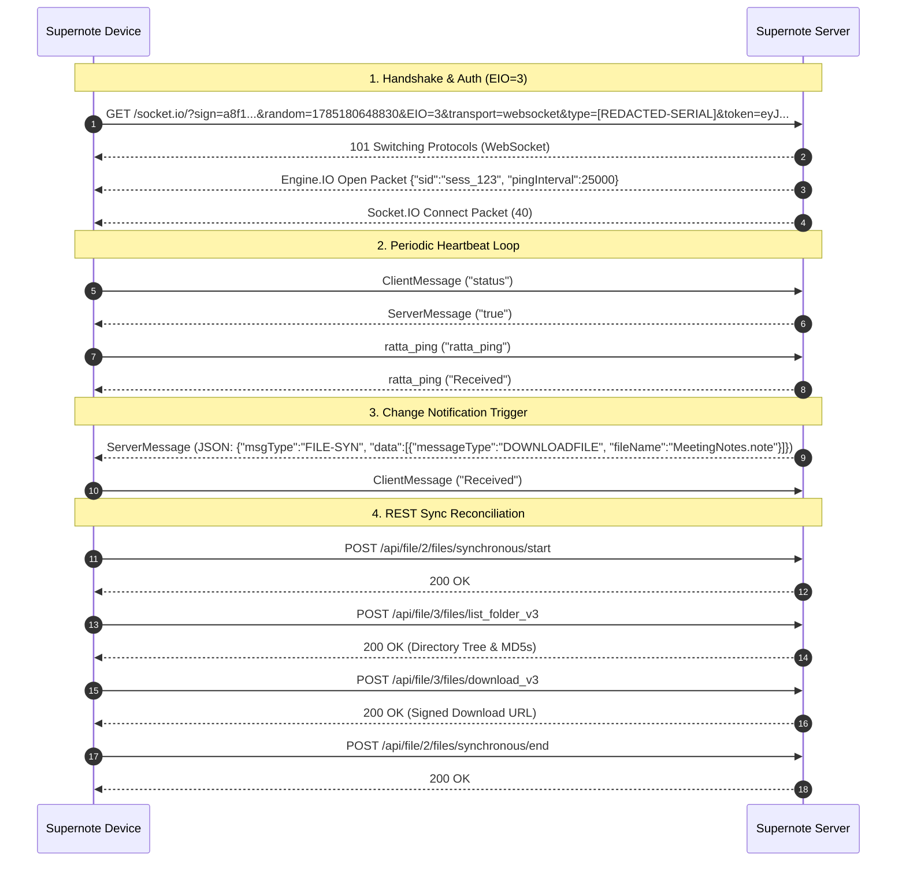

# Supernote Socket.IO API Specification

The Supernote Socket.IO service provides real-time bidirectional messaging between Supernote devices (Chauvet OS), client applications, and the server. It supports **Auto Sync** background notifications, live file sync status events, schedule/to-do updates, and document digest synchronizations.

---

## 1. Connection & Handshake

### Endpoint
```http
GET /socket.io/?sign={signature}&random={timestamp}&EIO=3&transport={transport}&type={equipmentNo}&token={jwtToken}
```

### Handshake Parameters

| Parameter | Type | Required | Description | Example |
| :--- | :--- | :--- | :--- | :--- |
| `EIO` | integer | Yes | Engine.IO protocol version (must be `3`). | `3` |
| `transport` | string | Yes | Protocol transport: `websocket` or `polling`. | `websocket` |
| `token` | string | Yes | JWT access token issued during device login. | `eyJhbGciOiJI...` |
| `type` | string | Yes | Device equipment serial number. | `[REDACTED-SERIAL]` |
| `random` | string | Yes | Client timestamp / nonce identifier. | `1785180648830` |
| `sign` | string | Yes | HMAC signature over authentication payload. | `a8f1b2...` |

### Signature Verification Formula
$$\text{SignaturePayload} = \text{token} + \text{"\_"} + \text{type} + \text{"\_"} + \text{random}$$

---

## 2. Authentication & Session Lifecycle

1. **Signature Validation**: Upon receiving a connection request, the server validates `sign` against `SignaturePayload`.
2. **Token Verification**: The server verifies `token` to resolve `userId` and equipment session.
3. **Auth Failure Response**: If signature or token validation fails, the server emits a `ServerMessage` error event and closes the socket:
   ```json
   {
     "code": "403",
     "msg": "sign authentication failed"
   }
   ```
4. **Internal Server Routing Identifiers**:
   - Internal session keys are generated on connection to track active sockets and un-ACKed message queues:
     - `fileChannelId`: `{userId}_fileSocket_{type}_{random}`
     - `fileUuid`: `{uid}_{userId}_{type}_file`
     - `todoChannelId`: `{userId}_todoSocket_{type}_{random}`
     - `digestChannelId`: `{userId}_digestSocket_{type}_{random}`
   - *Note*: `fileChannelId` and `fileUuid` are **internal server Redis routing keys**; they are managed server-side and are **never** included in client-facing JSON payloads.

---

## 3. Protocol Architecture & Client Synchronization Model

### 3.1. Purpose of Notifications (Hints vs. State Truth)
Socket.IO notifications function as **asynchronous hints/triggers** to inform connected devices that state has changed on another device.

### 3.2. Resilience & Missed Messages
* **ACK Protocol**: When the server sends a change notification, it holds the message in an internal queue until the client responds with a `ClientMessage` payload `"Received"`.
* **Heartbeat Re-flushing**: If a client drops connection or misses a packet, pending un-ACKed messages are automatically flushed when the client re-establishes a connection or sends a heartbeat (`ratta_ping` or `status`).
* **REST Reconciliation Source of Truth**: If a Socket.IO notification is completely lost, **no data corruption occurs**. Upon receiving a notification or during scheduled/manual sync, the Supernote device executes a REST sync session (`/api/file/2/files/synchronous/start` $\to$ `/list_folder_v3` $\to$ `/synchronous/end`) to reconcile local MD5 hashes against the server state. The REST API is the authoritative source of truth.

---

## 4. Event Catalog & Payload Specifications

### 4.1. Heartbeats (`ClientMessage` vs. `ratta_ping`)

Supernote firmware supports two heartbeat mechanisms:

1. **`ClientMessage` / `ServerMessage` (Single-Channel / Legacy)**:
   - Client sends event `ClientMessage` with payload `"status"`.
   - Server responds with event `ServerMessage` with payload `"true"` (literal string `"true"`).
   - Flushes pending file notifications.

2. **`ratta_ping` (Multi-Channel / Standard)**:
   - Client sends event `ratta_ping` with payload `"ratta_ping"`.
   - Server responds with event `ratta_ping` with payload `"Received"`.
   - Flushes pending notifications across all three channels (File, Schedule, and Digest).

#### Heartbeat Payload Summary

| Event Name | Direction | Payload Sent | Expected Response | Purpose |
| :--- | :--- | :--- | :--- | :--- |
| `ClientMessage` | Client $\to$ Server | `"status"` | `ServerMessage` `"true"` | Legacy file heartbeat. |
| `ratta_ping` | Client $\to$ Server | `"ratta_ping"` | `ratta_ping` `"Received"` | Multi-channel heartbeat. |
| `ClientMessage` | Client $\to$ Server | `"Received"` | (None - ACK acknowledged) | Client ACK for received push. |

---

### 4.2. File Synchronization (`ServerMessage`)

When file actions occur (upload, edit, delete, move), the server emits a `ServerMessage` containing a JSON string of `SocketMessageData`.

#### Payload Schema (`SocketMessageData`)

```json
{
  "code": "200",
  "msg": "Success",
  "timestamp": 1785509989000,
  "msgType": "FILE-SYN",
  "data": [
    {
      "messageType": "<ACTION_CONSTANT>",
      "equipmentNo": "<DEVICE_SERIAL>",
      "fileType": "FILE",
      "id": 10023,
      "originalName": "MeetingNotes.note",
      "newName": "MeetingNotes.note",
      "md5": "e10adc3949ba59abbe56e057f20f883e",
      "size": 1048576,
      "directoryId": 0,
      "timestamp": 1785509989000
    }
  ]
}
```

#### Action Constants (`messageType`)

| Constant | Description |
| :--- | :--- |
| `DOWNLOADFILE` / `ADDFILE` | New file uploaded by another device; client should download. |
| `ADDFOLDER` | New directory created. |
| `MODIFYFILE` | File content updated; client should re-sync file. |
| `MODIFYFOLDER` | Folder attributes updated. |
| `DELETEFILE` | File moved to trash or deleted. |
| `DELETEFOLDER` | Directory deleted. |
| `COPYFILE` / `COPYFOLDER` | Copy operation completed. |
| `MOVEFILE` / `MOVEFOLDER` | Move/rename operation completed (`originalName` $\to$ `newName`, `directoryId` $\to$ `goDirectoryId`). |
| `STARTSYNC` | Sync session initiated by another device on account. |
| `WAITING` | Sync request queued behind an active cloud lock. |

---

### 4.3. Schedule & Tasks (`to-do`)

Real-time synchronization channel for device calendar and task lists.

* **Event Name**: `to-do`
* **Message Type**: `TASK-SYN`

#### Example Payload (`to-do`)
```json
{
  "code": "200",
  "msg": "Success",
  "timestamp": 1785509989000,
  "msgType": "TASK-SYN",
  "data": [
    {
      "equipmentNo": "[REDACTED-SERIAL]",
      "taskListId": 501,
      "taskId": 1002,
      "action": "UPDATE_TASK",
      "timestamp": 1785509989000
    }
  ]
}
```

---

### 4.4. Digest & Summaries (`digest`)

Real-time synchronization channel for note summaries, digests, and tags.

* **Event Name**: `digest`
* **Message Type**: `DIGEST-SYN`

#### Example Payload (`digest`)
```json
{
  "code": "200",
  "msg": "Success",
  "timestamp": 1785509989000,
  "msgType": "DIGEST-SYN",
  "data": [
    {
      "equipmentNo": "[REDACTED-SERIAL]",
      "digestId": 302,
      "action": "ADD_DIGEST",
      "timestamp": 1785509989000
    }
  ]
}
```

---

## 5. End-to-End Sequence Diagram


