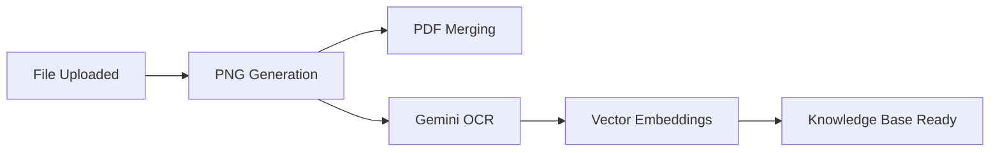

# Design Brainstorming: Asynchronous Note Processing

This document outlines the design space and considerations for evolving the Supernote Lite server to support multi-stage processing of `.note` files, including PDF/PNG conversion, OCR (via Gemini), and semantic embeddings.

## Objectives
- Support high-latency operations (OCR, Embeddings) without blocking user interactions.
- Ensure content is readily available for search and viewing.
- Optimize for cost (Gemini API usage) and resource utilization.

## 1. Triggering Mechanism
- **Hook on Upload/Update**: Trigger the pipeline immediately after `upload_finish`.
    - *Pros*: Data is always ready; ideal for "Instant Search" UX.
    - *Cons*: High resource floor; processes potentially unused files.
- **On-Demand with Persistence (Lazy)**: Trigger on first request (e.g., first semi-semantic search or first PDF view).
    - *Pros*: Cost-effective; only processes active files.
    - *Cons*: High latency for the "first" request.

## 2. Processing Pipeline Orchestration
Operations should be handled by an asynchronous task worker.

### Pipeline Stages:
1.  **Visual Extraction**: Convert notebook pages to PNG. (Dependency for OCR).
2.  **Document Assembly**: Merge PNGs into a standard PDF.
3.  **Intelligence Layer**:
    - Send PNGs to Gemini for high-fidelity OCR (handling handwriting).
    - Extract text and layout information.
4.  **Semantic Layer**:
    - Generate embeddings from OCR text using a model like `text-embedding-004`.
    - Store in a Vector Database.

## 3. Data Persistence
- **Artifacts (PNG/PDF)**: Continue using Blob Storage with a deterministic path: `processed/{file_id}/{md5}/...`.
- **Structured Metadata (OCR Text)**:
    - Primary: Store in a `FileKnowledge` table in the database for keyword search.
    - Secondary: Full JSON extraction in Blob Storage.
- **Vectors**: Use a Vector Store (e.g., pgvector, Chroma) for semantic retrieval.

## 4. Cache Invalidation & Consistency
- **MD5 Tracking**: Use the file's MD5 as the version key. If a file is updated on the device and synced, the mismatch triggers a re-process.
- **Incremental Logic**: If the file format allows, identify added/modified pages to avoid re-running Gemini OCR on unchanged pages.

## 5. Future "Knowledge API" Surface
- `GET /api/knowledge/{file_id}/search?q=...`: Semantic search within a specific notebook.
- `GET /api/knowledge/global-search?q=...`: Search across all user notes.
- `GET /api/knowledge/{file_id}/summary`: LLM-generated summary of the notebook content.
- `GET /api/knowledge/{file_id}/status`: Current processing state (`PENDING`, `OCR_COMPLETE`, `FAILED`, etc.).
